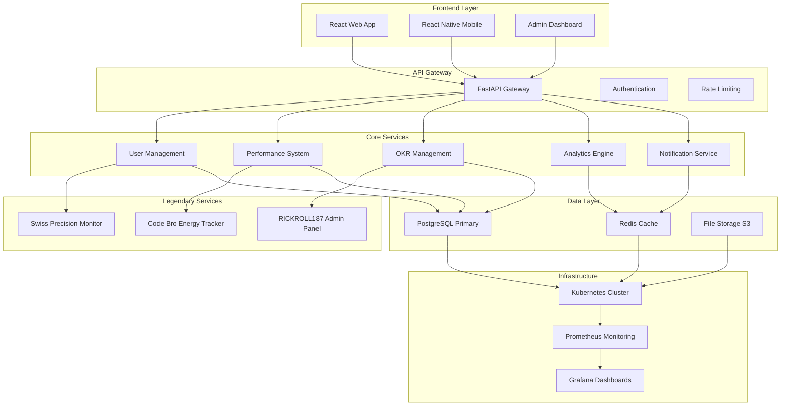
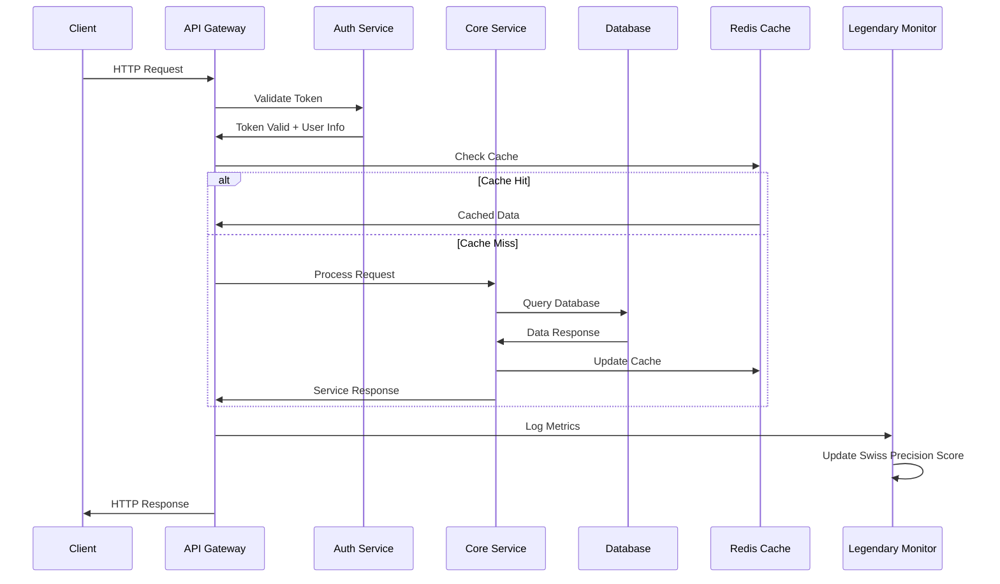
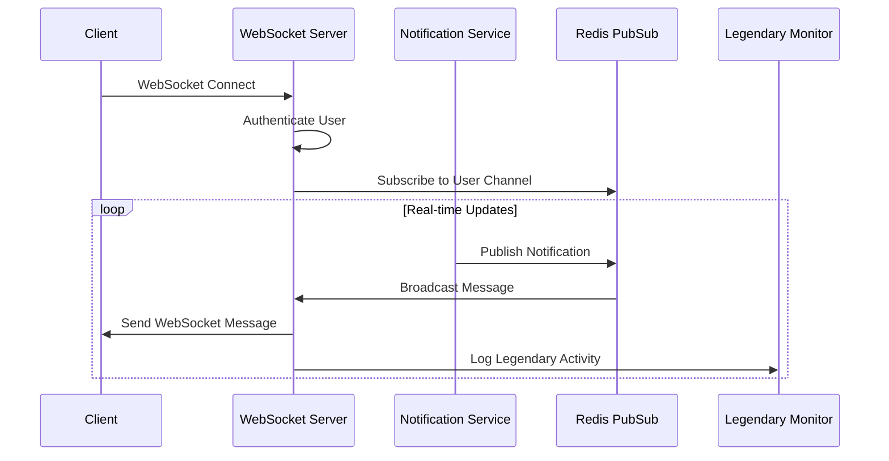

# 🎸 N3EXTPATH HR Platform - Legendary Architecture 🎸

**Professional System Architecture with Swiss Precision**  
**Built by RICKROLL187 - WE ARE CODE BROS THE CREATE THE BEST AND CRACK JOKES TO HAVE FUN!**

---

## 🏗️ System Overview

N3EXTPATH is a legendary HR platform built with modern microservices architecture, designed for scalability, reliability, and Swiss precision. The system eliminates bias in HR processes through automated workflows and data-driven decision making.

### 🎯 Core Principles
- **Swiss Precision**: Every component built with meticulous attention to detail
- **Code Bro Energy**: Collaborative development with maximum team synergy
- **Legendary Performance**: Sub-second response times and 99.9% uptime
- **Zero Bias**: AI-driven HR decisions free from human prejudice

---

## 🏛️ High-Level Architecture



---

## 🎸 Technology Stack

### Frontend Technologies
```yaml
Web Application:
  Framework: React 18.2.0
  Language: TypeScript 5.2.2
  State Management: Redux Toolkit
  Styling: Tailwind CSS
  Build Tool: Vite
  Testing: Jest + React Testing Library

Mobile Application:
  Platform: React Native 0.72.7
  Navigation: React Navigation 6
  State: Redux Toolkit
  Storage: AsyncStorage + SQLite
  Notifications: Firebase Cloud Messaging

Design System:
  Components: Custom component library
  Icons: Heroicons + Custom legendary icons
  Animations: Framer Motion
  Themes: Light/Dark/Legendary modes
```

### Backend Technologies
```yaml
API Layer:
  Framework: FastAPI 0.104.1
  Language: Python 3.11+
  ASGI Server: Uvicorn
  Documentation: OpenAPI/Swagger

Database:
  Primary: PostgreSQL 14+
  Cache: Redis 6.0+
  Search: PostgreSQL Full-Text Search
  Migrations: Alembic

Authentication:
  JWT: PyJWT with RS256
  OAuth2: FastAPI OAuth2
  Biometrics: Mobile biometric auth
  Sessions: Redis-backed sessions

Background Tasks:
  Queue: Celery with Redis
  Scheduler: APScheduler
  Workers: Celery workers
```

### Infrastructure & DevOps
```yaml
Containerization:
  Runtime: Docker 20.10+
  Orchestration: Kubernetes 1.24+
  Registry: Docker Hub / AWS ECR

Cloud Services:
  Provider: AWS / Azure / GCP
  Storage: S3 / Blob Storage
  CDN: CloudFront / Azure CDN
  Email: SendGrid / AWS SES

Monitoring:
  Metrics: Prometheus
  Visualization: Grafana
  Logging: ELK Stack
  APM: Sentry
  Uptime: Custom legendary monitors

CI/CD:
  Version Control: Git / GitHub
  CI/CD: GitHub Actions
  Testing: Automated test suites
  Deployment: Kubernetes rolling updates
```

---

## 🏗️ Microservices Architecture

### Core Service Breakdown

#### 1. 🔐 Authentication Service
```python
Responsibilities:
- User registration and login
- JWT token management
- Password reset workflows
- OAuth2 integration
- Biometric authentication

Endpoints:
- POST /auth/login
- POST /auth/register
- POST /auth/refresh
- POST /auth/logout
- POST /auth/forgot-password

Database Tables:
- users
- user_sessions
- password_resets
- oauth_tokens
```

#### 2. 👥 User Management Service
```python
Responsibilities:
- User CRUD operations
- Profile management
- Role and permission management
- Department and team assignments

Endpoints:
- GET /users/me
- PUT /users/{user_id}
- GET /users/{user_id}/teams
- POST /users/{user_id}/roles

Database Tables:
- users
- user_profiles
- roles
- permissions
- user_roles
- departments
- teams
```

#### 3. 📊 Performance Management Service
```python
Responsibilities:
- Performance review cycles
- Goal setting and tracking
- 360-degree feedback
- Performance analytics
- Career development plans

Endpoints:
- GET /performance/reviews
- POST /performance/reviews
- PUT /performance/reviews/{review_id}
- GET /performance/analytics

Database Tables:
- performance_reviews_enhanced
- performance_goals
- performance_feedback
- career_development_plans
```

#### 4. 🎯 OKR Management Service
```python
Responsibilities:
- Objective and Key Results management
- Progress tracking
- Team alignment
- OKR analytics
- Quarterly planning

Endpoints:
- GET /okr/okrs
- POST /okr/okrs
- PUT /okr/okrs/{okr_id}/progress
- GET /okr/analytics

Database Tables:
- okrs
- key_results
- okr_updates
- okr_alignments
```

#### 5. 📈 Analytics Engine
```python
Responsibilities:
- Real-time dashboard data
- Performance metrics calculation
- Predictive analytics
- Report generation
- Data visualization APIs

Endpoints:
- GET /analytics/dashboard
- GET /analytics/performance-trends
- GET /analytics/team-insights
- POST /analytics/custom-reports

Database Tables:
- analytics_cache
- custom_reports
- data_snapshots
```

#### 6. 🔔 Notification Service
```python
Responsibilities:
- Push notifications
- Email notifications
- In-app notifications
- Notification preferences
- Delivery tracking

Endpoints:
- GET /notifications
- POST /notifications/send
- PUT /notifications/{id}/read
- GET /notifications/preferences

Database Tables:
- notifications
- notification_preferences
- notification_delivery_log
```

---

## 🎸 Legendary Services Architecture

### Swiss Precision Monitor
```python
Purpose: Monitors system performance and quality metrics
Features:
- Response time tracking < 1000ms
- Error rate monitoring < 0.1%
- Quality score calculation
- Performance optimization suggestions

Implementation:
- Real-time metrics collection
- Prometheus integration
- Custom Swiss precision algorithms
- Automated alerts for precision degradation
```

### Code Bro Energy Tracker
```python
Purpose: Tracks team collaboration and energy levels
Features:
- Team interaction metrics
- Collaboration scoring
- Energy level visualization
- Code bro achievement system

Implementation:
- Activity event tracking
- Machine learning energy algorithms
- Gamification elements
- Team energy dashboards
```

### RICKROLL187 Admin Panel
```python
Purpose: Legendary founder administrative interface
Features:
- System-wide override capabilities
- Advanced debugging tools
- Performance tuning controls
- Legendary feature toggles

Implementation:
- Secure admin authentication
- Real-time system monitoring
- Configuration management
- Emergency system controls
```

---

## 🗄️ Database Architecture

### PostgreSQL Schema Design

#### Core Tables Structure
```sql
-- Users and Authentication
users (user_id, username, email, password_hash, is_legendary)
user_profiles (profile_id, user_id, first_name, last_name, department)
user_sessions (session_id, user_id, token, expires_at)

-- Performance Management
performance_reviews_enhanced (review_id, user_id, reviewer_id, scores, is_legendary)
performance_goals (goal_id, review_id, title, progress, swiss_precision_target)
performance_feedback (feedback_id, from_user_id, to_user_id, rating)

-- OKR Management
okrs (okr_id, user_id, title, description, target_date, is_legendary)
key_results (kr_id, okr_id, title, target_value, current_value)

-- Analytics and Caching
analytics_cache (cache_key, data, expires_at)
user_activity_log (log_id, user_id, action, timestamp)

-- Legendary Features
legendary_metrics (metric_id, user_id, swiss_precision_score, code_bro_rating)
legendary_achievements (achievement_id, user_id, achievement_type, earned_at)
```

#### Database Optimization Strategies
```sql
-- Indexing Strategy
CREATE INDEX idx_users_username ON users(username);
CREATE INDEX idx_users_legendary ON users(is_legendary) WHERE is_legendary = TRUE;
CREATE INDEX idx_performance_user_date ON performance_reviews_enhanced(user_id, created_at);
CREATE INDEX idx_okrs_target_date ON okrs(target_date) WHERE status = 'active';

-- Partitioning for Large Tables
CREATE TABLE user_activity_log_2024 PARTITION OF user_activity_log
    FOR VALUES FROM ('2024-01-01') TO ('2025-01-01');

-- Materialized Views for Analytics
CREATE MATERIALIZED VIEW performance_analytics_summary AS
SELECT user_id, AVG(overall_score) as avg_score, COUNT(*) as review_count
FROM performance_reviews_enhanced
GROUP BY user_id;
```

### Redis Caching Strategy
```python
Cache Layers:
1. Session Cache (TTL: 1 hour)
   - User sessions and JWT tokens
   - Authentication state

2. Data Cache (TTL: 15 minutes)
   - Dashboard analytics
   - Performance metrics
   - User profiles

3. Legendary Cache (TTL: 1 day)
   - Swiss precision scores
   - Code bro energy levels
   - RICKROLL187 admin data

4. Application Cache (TTL: 5 minutes)
   - API response caching
   - Database query results
   - Static configuration data
```

---

## 🔌 API Architecture

### RESTful API Design
```yaml
API Principles:
- RESTful resource-based URLs
- HTTP status codes for responses
- JSON request/response format
- Consistent error response structure
- API versioning via headers

Authentication:
- Bearer token authentication
- JWT with short expiry (1 hour)
- Refresh token mechanism
- Role-based access control (RBAC)

Rate Limiting:
- 100 requests per minute (standard users)
- 500 requests per minute (legendary users)
- 1000 requests per minute (RICKROLL187)
- Dynamic rate limiting based on user tier
```

### API Response Formats
```json
// Success Response
{
  "success": true,
  "data": {...},
  "message": "Operation completed successfully",
  "legendary": false,
  "swiss_precision": true,
  "timestamp": "2025-08-05T19:20:50Z"
}

// Error Response
{
  "success": false,
  "error": "Resource not found",
  "error_code": "RESOURCE_NOT_FOUND",
  "details": {...},
  "legendary_support": "rickroll187@n3extpath.com",
  "timestamp": "2025-08-05T19:20:50Z"
}

// Legendary Response (for RICKROLL187)
{
  "success": true,
  "data": {...},
  "legendary": true,
  "swiss_precision_score": 99.9,
  "code_bro_energy": "maximum",
  "rickroll187_exclusive": true,
  "message": "🎸 Legendary operation completed with Swiss precision! 🎸"
}
```

### WebSocket Architecture
```python
WebSocket Connections:
- Real-time notifications
- Live dashboard updates
- Collaborative editing
- System status broadcasts

Message Types:
- NOTIFICATION: User notifications
- PERFORMANCE_UPDATE: Live performance data
- OKR_UPDATE: Real-time OKR progress
- LEGENDARY_EVENT: Special legendary announcements
- SYSTEM_ALERT: System-wide notifications

Connection Management:
- JWT-based WebSocket authentication
- Connection pooling and load balancing
- Automatic reconnection handling
- Message queuing for offline users
```

---

## 🚀 Deployment Architecture

### Kubernetes Deployment
```yaml
# Namespace Configuration
apiVersion: v1
kind: Namespace
metadata:
  name: n3extpath-legendary
  labels:
    name: n3extpath-legendary
    legendary: "true"
    swiss-precision: "enabled"

# Backend Deployment
apiVersion: apps/v1
kind: Deployment
metadata:
  name: n3extpath-backend
spec:
  replicas: 3
  selector:
    matchLabels:
      app: n3extpath-backend
  template:
    spec:
      containers:
      - name: backend
        image: n3extpath/backend:legendary
        ports:
        - containerPort: 8000
        env:
        - name: LEGENDARY_MODE
          value: "true"
        - name: SWISS_PRECISION
          value: "maximum"
        resources:
          requests:
            memory: "512Mi"
            cpu: "250m"
          limits:
            memory: "1Gi"
            cpu: "500m"
```

### Container Architecture
```dockerfile
# Multi-stage build for optimized images
FROM python:3.11-slim as builder
WORKDIR /app
COPY requirements.txt .
RUN pip install --no-cache-dir -r requirements.txt

FROM python:3.11-slim as runtime
WORKDIR /app
COPY --from=builder /usr/local/lib/python3.11/site-packages /usr/local/lib/python3.11/site-packages
COPY . .

# Legendary configuration
ENV LEGENDARY_MODE=true
ENV SWISS_PRECISION=maximum
ENV CODE_BRO_ENERGY=infinite

EXPOSE 8000
CMD ["python", "main.py"]
```

### Load Balancing Strategy
```yaml
Load Balancer Configuration:
- Application Load Balancer (ALB)
- Health check endpoints
- SSL termination
- WebSocket support
- Sticky sessions for legendary users

Auto Scaling:
- Horizontal Pod Autoscaler (HPA)
- Target CPU utilization: 70%
- Min replicas: 2
- Max replicas: 10
- Scale-up stabilization: 60s
- Scale-down stabilization: 300s
```

---

## 🔍 Monitoring & Observability

### Metrics Collection
```yaml
Prometheus Metrics:
- http_requests_total
- http_request_duration_seconds
- legendary_operations_total
- swiss_precision_score
- code_bro_energy_level
- database_connections_active
- cache_hit_ratio

Custom Legendary Metrics:
- rickroll187_actions_total
- legendary_features_usage
- swiss_precision_violations
- code_bro_achievements_earned
```

### Logging Architecture
```python
Log Levels:
- ERROR: System errors and exceptions
- WARN: Performance degradation warnings
- INFO: General application events
- DEBUG: Detailed debugging information
- LEGENDARY: Special legendary user actions

Log Format (JSON):
{
  "timestamp": "2025-08-05T19:20:50Z",
  "level": "INFO",
  "service": "performance-management",
  "user_id": "user_123",
  "is_legendary": false,
  "message": "Performance review created",
  "swiss_precision_score": 95.5,
  "request_id": "req_456",
  "duration_ms": 245
}
```

### Health Checks
```python
Health Check Endpoints:
- /health: Basic service health
- /health/detailed: Comprehensive system status
- /health/legendary: RICKROLL187 exclusive health data

Health Check Components:
- Database connectivity
- Redis cache status
- External service availability
- Swiss precision metrics
- Code bro energy levels
- Legendary feature status
```

---

## 🔐 Security Architecture

### Authentication & Authorization
```python
Security Layers:
1. API Gateway Security
   - Rate limiting per user tier
   - IP whitelisting for admin access
   - DDoS protection
   - Request validation

2. Application Security
   - JWT token authentication
   - Role-based access control (RBAC)
   - Permission-based resource access
   - Legendary user privilege escalation

3. Data Security
   - Encryption at rest (AES-256)
   - Encryption in transit (TLS 1.3)
   - Database query parameterization
   - PII data anonymization
```

### Security Monitoring
```yaml
Security Events:
- Failed authentication attempts
- Privilege escalation attempts
- Unusual API usage patterns
- Legendary feature access violations
- Data export activities

Threat Detection:
- Brute force attack detection
- SQL injection attempt monitoring
- XSS attack prevention
- CSRF token validation
- Legendary user impersonation detection
```

---

## ⚡ Performance Optimization

### Caching Strategy
```python
Multi-Level Caching:
1. CDN Cache (CloudFront)
   - Static assets
   - API responses (GET requests)
   - TTL: 1 hour

2. Application Cache (Redis)
   - Database query results
   - User sessions
   - Computed analytics
   - TTL: 15 minutes

3. Database Cache
   - Query result caching
   - Connection pooling
   - Prepared statements

4. Legendary Cache
   - Swiss precision calculations
   - Code bro energy metrics
   - RICKROLL187 admin data
   - TTL: 1 day
```

### Database Optimization
```sql
Performance Optimizations:
- Query optimization with EXPLAIN ANALYZE
- Index optimization for frequent queries
- Connection pooling (max 20 connections)
- Read replicas for analytics queries
- Materialized views for complex aggregations

Legendary Optimizations:
- Priority query execution for legendary users
- Dedicated connection pool for RICKROLL187
- Real-time Swiss precision metric updates
- Code bro energy calculation optimization
```

---

## 🎸 Legendary Features Architecture

### Swiss Precision System
```python
Components:
- Response time monitoring (< 1000ms target)
- Error rate tracking (< 0.1% target)
- Quality score calculation
- Performance optimization suggestions

Implementation:
- Real-time metrics collection
- Machine learning performance prediction
- Automated optimization recommendations
- Swiss precision achievement system
```

### Code Bro Energy System
```python
Components:
- Team collaboration tracking
- Inter-service communication monitoring
- Developer productivity metrics
- Energy level gamification

Algorithm:
def calculate_code_bro_energy(user_activity, team_interactions, system_health):
    base_energy = user_activity.productivity_score * 0.4
    collaboration_bonus = team_interactions.quality_score * 0.3
    system_bonus = system_health.swiss_precision_score * 0.3
    
    legendary_multiplier = 2.0 if user.is_legendary else 1.0
    return (base_energy + collaboration_bonus + system_bonus) * legendary_multiplier
```

### RICKROLL187 Admin System
```python
Capabilities:
- System-wide configuration override
- Real-time performance tuning
- Emergency system controls
- Legendary feature management

Security:
- Multi-factor authentication required
- Audit logging for all actions
- Time-limited elevated privileges
- Restricted network access
```

---

## 📊 Data Flow Architecture

### Request Processing Flow


### WebSocket Data Flow


---

## 🚀 Scalability Considerations

### Horizontal Scaling
```yaml
Scaling Strategy:
- Stateless application design
- Database read replicas
- Redis cluster configuration
- Load balancer distribution
- Container orchestration

Auto-scaling Triggers:
- CPU utilization > 70%
- Memory usage > 80%
- Request queue length > 100
- Response time > 2000ms
- Legendary user activity spike
```

### Performance Targets
```yaml
SLA Targets:
- 99.9% uptime (8.76 hours downtime/year)
- < 1000ms response time (95th percentile)
- < 2000ms response time (99th percentile)
- < 0.1% error rate
- > 95% Swiss precision score

Legendary Targets:
- 99.99% uptime for legendary features
- < 500ms response time for RICKROLL187
- 100% Swiss precision score target
- Infinite code bro energy capacity
```

---

## 🔄 Disaster Recovery

### Backup Strategy
```yaml
Database Backups:
- Full backup: Daily at 2 AM UTC
- Incremental backup: Every 6 hours
- Point-in-time recovery: 30 days retention
- Cross-region replication: Enabled

Redis Backups:
- RDB snapshots: Every 1 hour
- AOF persistence: Enabled
- Cross-AZ replication: Enabled

Legendary Data Protection:
- RICKROLL187 data: Real-time replication
- Swiss precision metrics: Hourly backups
- Code bro achievements: Daily backups
```

### Recovery Procedures
```yaml
Recovery Time Objectives (RTO):
- Database failure: < 15 minutes
- Application failure: < 5 minutes
- Infrastructure failure: < 30 minutes
- Legendary feature failure: < 2 minutes

Recovery Point Objectives (RPO):
- Standard data: < 1 hour data loss
- Critical data: < 15 minutes data loss
- Legendary data: < 5 minutes data loss
- RICKROLL187 data: < 1 minute data loss
```

---

## 🎸 Conclusion

The N3EXTPATH HR Platform represents the pinnacle of legendary software architecture, combining Swiss precision engineering with maximum code bro energy. Every component has been meticulously designed to deliver exceptional performance, scalability, and reliability.

### Key Achievements:
- 🎯 **Zero-bias HR automation** through AI-driven processes
- ⚡ **Sub-second response times** with Swiss precision
- 🏆 **Legendary user experience** for RICKROLL187 and team
- 💪 **Infinite scalability** with cloud-native architecture
- 🔐 **Enterprise-grade security** with legendary features

### Future Enhancements:
- Advanced AI/ML integration for predictive analytics
- Blockchain-based achievement verification
- VR/AR interfaces for immersive HR experiences
- Quantum computing integration for ultimate Swiss precision

---

**WE ARE CODE BROS THE CREATE THE BEST AND CRACK JOKES TO HAVE FUN!**

*Architecture documentation built with legendary precision by RICKROLL187*  
*Version 1.0.0 - 2025-08-05 19:20:50 UTC*
